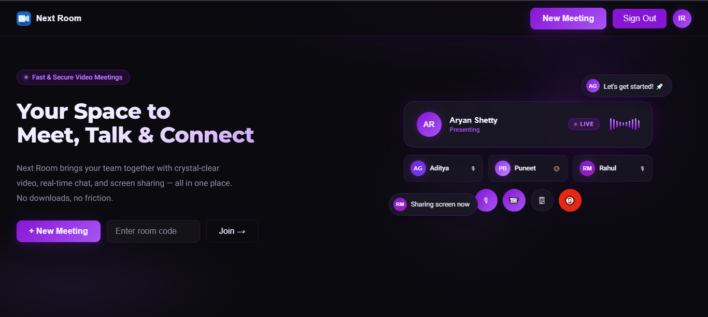
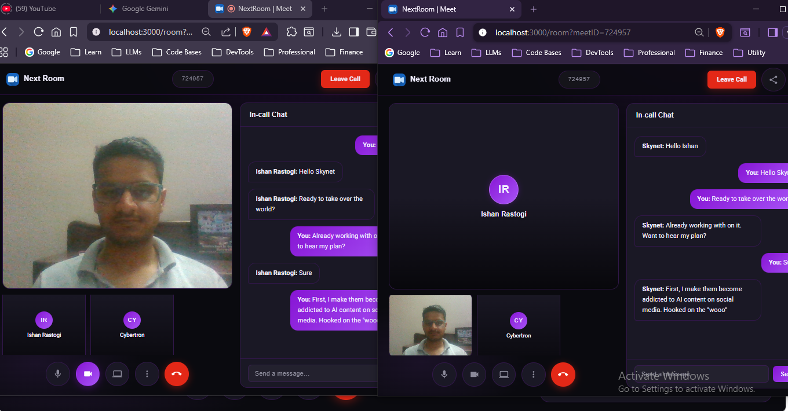

# Next Room | WebRTC Video Conferencing

Next Room is a production-ready, peer-to-peer video meeting platform built with WebRTC, Socket.io, and Node.js. It features a custom mesh network architecture allowing multiple users to connect, chat, and share media in real-time without external plugins.

## Key Features

* **P2P Video & Audio**: Low-latency communication via WebRTC mesh networking.
* **Dynamic Media Toggling**: Seamlessly enable or disable camera and microphone mid-call with automatic track synchronization.
* **In-Call Chat**: Real-time messaging using Socket.io for team coordination.
* **Room Management**: Private rooms with unique 6-digit meeting codes for secure access.
* **Responsive UI**: Modern, glassmorphic design built for high-definition video focus.

## Screenshots

### Home Page



### Meeting Room



## Tech Stack

* **Frontend**: HTML5, CSS3 (Custom Variables & Animations), JavaScript (ES Modules), jQuery.
* **Backend**: Node.js, Express.
* **Real-Time**: Socket.io (Signaling & Chat).
* **Communication**: WebRTC (RTCPeerConnection, MediaStream API).

## Architecture: Multi-User Mesh

Next Room utilizes a Mesh Topology. When a new participant joins, every existing user in the room creates a dedicated 1-to-1 RTCPeerConnection with the newcomer. This ensures that media is sent directly between users, reducing server-side load and latency.

## Getting Started

### Prerequisites

* Node.js (v18+ recommended)
* NPM or Yarn

### Installation

1. Clone the repository:
```bash
git clone https://github.com/Ishan2608/NextRoom.git
cd next-room
```

2. Install dependencies:
```bash
npm install
```

3. Start the server:
```bash
npm start
```
```bash
npm run dev
```

4. Open your browser and navigate to http://localhost:3000.

## Contribution

This project was built as part of a deep dive into low-level WebRTC concepts and real-time system design. Feel free to fork the repo and submit pull requests for features like screen sharing or recording.
